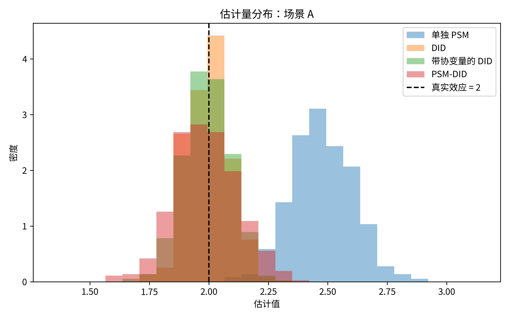
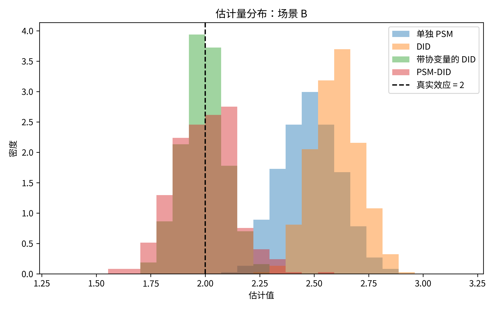
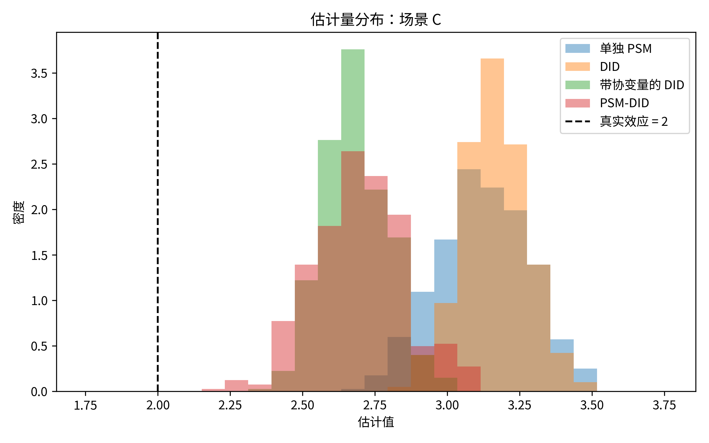
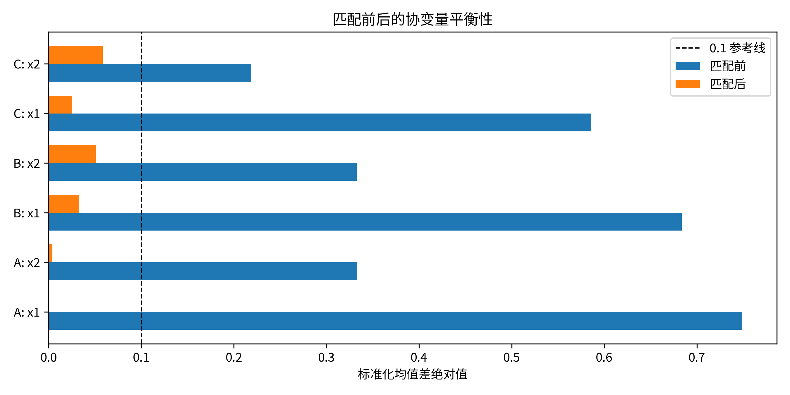
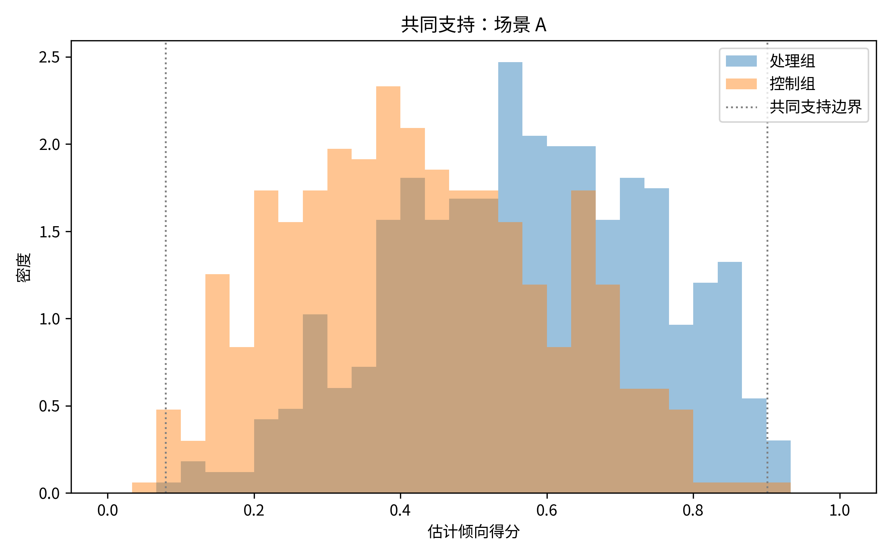
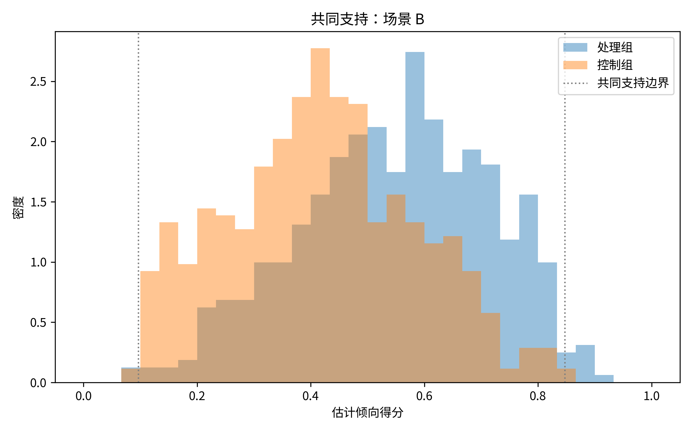
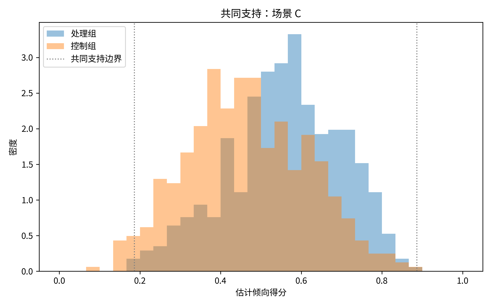

# HW1：通过 Monte Carlo 模拟理解 PSM-DID

## 1. 引言

本报告使用 Monte Carlo 模拟考察倾向得分匹配（propensity score matching，PSM）、双重差分（difference-in-differences，DID）以及 PSM-DID 在什么条件下能够恢复真实处理效应，以及在什么条件下会失败。本文的目标不是证明某一种估计方法总是最好，而是把估计量的表现和因果识别假设对应起来。

模拟部分比较三个场景。场景 A 使无条件平行趋势成立，因此简单 DID 应该表现较好。场景 B 让未处理潜在结果的趋势依赖处理前可观测协变量，因此匹配或协变量调整可以改善简单 DID。场景 C 引入随时间变化的不可观测混淆因素，用来说明即使可观测协变量已经平衡，PSM-DID 仍然可能失败。

最终 Monte Carlo 设计使用样本量 `N = 1000`，每个场景重复 `R = 500` 次，真实处理效应 `\tau = 2.0`，包含场景 A、B、C。匹配只使用处理前可观测协变量 `x1` 和 `x2`，采用 1 个最近邻、允许放回的倾向得分匹配，且不设置 caliper。报告中的所有结果均来自 正式输出，而不是 调试运行。

## 2. 识别背景：PSM、DID 与 PSM-DID

### 2.1 倾向得分匹配

PSM 的目标是把处理组个体与具有相似处理前可观测协变量的控制组个体进行比较。在本项目中，匹配只基于 `x1` 和 `x2`。估计倾向得分时不使用结果变量、处理后变量、个体固定异质性、不可观测变量 `u`，也不使用数据生成过程中的真实倾向得分。

当处理选择主要由可观测协变量驱动时，PSM 有助于提高处理组和控制组的可比性。它的核心弱点是无法消除不可观测混淆因素带来的偏误，也不能像 DID 那样通过差分消除时间不变的不可观测异质性。因此，即使可观测协变量匹配得很好，只使用处理后结果水平的 单独 PSM 估计量仍可能有偏。

### 2.2 双重差分

DID 比较处理组和控制组在处理前后的结果变化。它的核心识别假设是平行趋势：如果没有处理，处理组和控制组的平均结果趋势应当相同。DID 可以消除组间时间不变的不可观测差异，但如果未处理潜在结果趋势在处理组和控制组之间系统性不同，DID 就会失败。

在本文的两期设定中，简单 DID 基于个体层面的变化量：

```text
Delta Y_i = Y_i1 - Y_i0
```

并在 `Delta Y_i` 对 `D_i` 的回归中取处理变量系数作为 DID 估计值。

### 2.3 PSM-DID

PSM-DID 结合了匹配和 DID 的思路。首先，使用处理前可观测协变量把处理组个体匹配到相似的控制组个体；然后，在匹配样本上实施 DID，或者等价地比较匹配个体的结果变化量。其逻辑是：在完整样本中无条件平行趋势可能不可信，但在处理前可观测协变量相近的匹配样本中，条件平行趋势可能更可信。

不过，PSM-DID 并不是解决所有内生性问题的工具。匹配只能改善可观测协变量的平衡，不能证明平行趋势，也不能消除随时间变化的不可观测混淆因素。

## 3. Monte Carlo 设计

### 3.1 共同设定

每次模拟包含两个时期：处理前和处理后。处理在个体层面分配，并且只在处理后时期影响结果。真实处理效应设为常数：

```text
tau = 2.0
```

由于处理效应为常数，数据生成过程中总体平均处理效应（ATE）和处理组平均处理效应（ATT）在数值上相同。不过，匹配类估计量仍更自然地解释为 ATT 风格估计量，因为它们围绕处理组个体寻找可比的控制组。

每个数据集都包含可观测协变量 `x1` 和 `x2`、时间不变异质性 `alpha`，并且在场景 C 中还包含不可观测变量 `u`。`alpha` 和 `u` 只用于模拟诊断，不允许进入任何估计器。

处理采用概率分配。在场景 A 和 B 中，潜在处理指数依赖 `x1`、`x2` 和 `alpha`。在场景 C 中，它还依赖不可观测变量 `u`：

```text
Pr(D_i = 1) = Lambda(gamma_0 + gamma_1 x1_i + gamma_2 x2_i + gamma_alpha alpha_i)
Pr(D_i = 1) = Lambda(gamma_0 + gamma_1 x1_i + gamma_2 x2_i + gamma_alpha alpha_i + gamma_u u_i)  [场景 C]
```

### 3.2 场景 A：无条件平行趋势

场景 A 允许处理选择依赖可观测协变量 `X_i` 和时间不变异质性 `alpha_i`，但未处理潜在结果趋势在所有个体之间相同。其简化形式为：

```text
Y_i0 = beta_0 + beta_1 x1_i + beta_2 x2_i + alpha_i + epsilon_i0
Delta_i(0) = lambda_time
Y_i1(0) = beta_0 + beta_1 x1_i + beta_2 x2_i + alpha_i + Delta_i(0) + epsilon_i1
Y_i1(1) = Y_i1(0) + tau
```

该场景的识别特征是，未处理趋势既不依赖处理状态，也不依赖协变量。因此，无条件平行趋势成立，简单 DID 应当表现较好。PSM-DID 也应接近真实值，但不应明显优于 DID，因为恢复平行趋势并不需要匹配。单独 PSM 可能有偏，因为它比较处理后结果水平，无法差分掉 `alpha_i`。

### 3.3 场景 B：由可观测协变量驱动的趋势差异

场景 B 使处理选择依赖可观测协变量，同时让未处理潜在结果趋势也依赖相同协变量。其简化形式为：

```text
Y_i0 = beta_0 + beta_1 x1_i + beta_2 x2_i + alpha_i + epsilon_i0
Delta_i(0) = lambda_time + kappa_1 x1_i + kappa_2 x2_i
Y_i1(0) = beta_0 + beta_1 x1_i + beta_2 x2_i + alpha_i + Delta_i(0) + epsilon_i1
Y_i1(1) = Y_i1(0) + tau
```

在该场景下，处理组和控制组在与趋势相关的协变量分布上不同，因此无条件 DID 会失败。带协变量的 DID 和 PSM-DID 应当改善估计，因为它们都处理了 `x1` 和 `x2` 上的可观测差异。这是展示 PSM-DID 为什么可能有用的核心场景。

### 3.4 场景 C：随时间变化的不可观测混淆

场景 C 引入不可观测变量 `u_i`，它同时影响处理选择和未处理潜在结果趋势。估计器不能使用 `u_i`。其简化形式为：

```text
Y_i0 = beta_0 + beta_1 x1_i + beta_2 x2_i + alpha_i + epsilon_i0
Delta_i(0) = lambda_time + kappa_1 x1_i + kappa_2 x2_i + delta_u u_i
Y_i1(0) = beta_0 + beta_1 x1_i + beta_2 x2_i + alpha_i + Delta_i(0) + epsilon_i1
Y_i1(1) = Y_i1(0) + tau
```

该场景展示 PSM-DID 的边界。匹配可以改善 `x1` 和 `x2` 的平衡，但无法消除由 `u_i` 驱动的趋势差异。如果未观测的随时间变化混淆因素很重要，带协变量的 DID 和 PSM-DID 可能相对于简单 DID 降低部分偏误，但仍会有偏。

## 4. 估计方法

### 4.1 单独 PSM

单独 PSM 估计器首先使用 `x1` 和 `x2` 估计倾向得分，将处理组个体匹配到控制组个体，然后比较处理后结果：

```text
E[Y_i1 | D_i = 1] - E[Y_m(i),1 | matched control]
```

这是一个 ATT 风格的截面匹配估计器。它不使用处理前结果，因此不能消除时间不变的不可观测异质性。

### 4.2 简单 DID

简单 DID 使用个体层面的结果变化：

```text
Delta Y_i = a + tau D_i + e_i
```

`D_i` 的系数就是 DID 估计值。当处理组和控制组在未处理状态下满足平行趋势时，该估计量有效。

### 4.3 带协变量的 DID

带协变量的 DID 同样使用差分结果：

```text
Delta Y_i = a + tau D_i + theta_1 x1_i + theta_2 x2_i + e_i
```

这一点很重要。由于本文两期数据中的协变量是时间不变的，估计器并不是简单地在长格式 DID 回归中加入 `x1` 和 `x2` 的主效应。等价的长格式写法需要加入处理后时期与协变量的交互项。

### 4.4 PSM-DID

PSM-DID 首先用 `x1` 和 `x2` 估计倾向得分，并据此匹配处理组和控制组。之后比较匹配个体的结果变化：

```text
ATT_PSM-DID = mean_{i:D_i=1} [Delta Y_i - Delta Y_m(i)]
```

该估计器是 ATT 风格的，因为它围绕处理组个体构造匹配样本。在本模拟的常数处理效应设定下，ATT 和 ATE 都等于 `2.0`，但匹配程序的解释仍更接近 ATT。

本文的匹配规则为 1 个最近邻、允许放回匹配，未设置 caliper。共同支持用于诊断和解释匹配可比性，不作为额外的 trimming 规则来裁剪最终估计样本。

## 5. 模拟结果

最终 Monte Carlo 汇总结果保存在 `tables/monte_carlo_summary_final.csv`。表 1 报告平均估计值、偏误、RMSE 和 Monte Carlo 标准差。

**表 1. 最终 Monte Carlo 汇总结果**

| 场景 | 估计器 | 平均估计值 | 偏误 | RMSE | 标准差 |
|---|---:|---:|---:|---:|---:|
| A | DID | 1.998 | -0.002 | 0.089 | 0.089 |
| A | 带协变量的 DID | 1.996 | -0.004 | 0.097 | 0.097 |
| A | 单独 PSM | 2.476 | 0.476 | 0.494 | 0.130 |
| A | PSM-DID | 1.987 | -0.013 | 0.134 | 0.133 |
| B | DID | 2.602 | 0.602 | 0.611 | 0.106 |
| B | 带协变量的 DID | 1.993 | -0.007 | 0.097 | 0.097 |
| B | 单独 PSM | 2.483 | 0.483 | 0.500 | 0.130 |
| B | PSM-DID | 1.999 | -0.001 | 0.137 | 0.137 |
| C | DID | 3.164 | 1.164 | 1.170 | 0.112 |
| C | 带协变量的 DID | 2.683 | 0.683 | 0.692 | 0.110 |
| C | 单独 PSM | 3.123 | 1.123 | 1.134 | 0.158 |
| C | PSM-DID | 2.693 | 0.693 | 0.710 | 0.157 |

估计量分布见以下 final 图：







## 6. 诊断：平衡性与共同支持

平衡性诊断保存在 `tables/balance_table_final.csv`，共同支持汇总保存在 `tables/common_support_summary_final.csv`。

场景 B 的平衡性诊断尤其重要，因为它是 PSM-DID 应当发挥作用的场景。匹配前，处理组和控制组在 `x1` 和 `x2` 上明显不平衡。匹配后，`x1` 的标准化均值差从约 `0.684` 降至 `0.033`，`x2` 的标准化均值差从约 `0.333` 降至 `-0.051`。这说明匹配显著改善了观测协变量平衡。



共同支持图展示了处理组和控制组的估计倾向得分分布。共同支持很重要，因为如果处理组个体找不到相似的控制组，匹配会丢弃大量样本、改变估计对象，并可能提高估计方差。







不过，观测协变量平衡并不能证明平行趋势。它只能说明处理组和控制组在所匹配的可观测变量上更相似。场景 C 正是说明：即使 `x1` 和 `x2` 达到较好平衡，如果未观测变量 `u_i` 同时影响处理选择和趋势，PSM-DID 仍会有偏。

## 7. 结果解释

### 7.1 场景 A

场景 A 验证了 DID 的基本逻辑。DID 的偏误几乎为零，为 `-0.002`；PSM-DID 也接近真实效应，偏误为 `-0.013`。带协变量的 DID 同样准确。这个结果符合预期，因为各个体的未处理趋势是共同的。

单独 PSM 明显向上偏误，偏误为 `0.476`。这反映了只使用处理后结果水平的限制。由于 单独 PSM 不能差分掉时间不变异质性，即使匹配了可观测协变量，也可能保持偏误。

### 7.2 场景 B

场景 B 展示了 PSM-DID 为什么有用。简单 DID 的正偏误较大，为 `0.602`，因为处理组和控制组在影响未处理趋势的可观测协变量上分布不同。相比之下，带协变量的 DID 偏误为 `-0.007`，PSM-DID 偏误为 `-0.001`。

这一结果支持条件平行趋势的逻辑。当 `x1` 和 `x2` 可以解释趋势差异时，直接控制这些变量，或者先基于这些变量匹配再做 DID，都可以恢复更好的可比性。场景 B 的平衡性表进一步支持这一解释，因为匹配显著降低了两个协变量的标准化均值差。

### 7.3 场景 C

场景 C 展示了 PSM-DID 的局限。简单 DID 严重偏误，偏误为 `1.164`。带协变量的 DID 和 PSM-DID 相对于简单 DID 有所改善，但仍远离真实效应：二者偏误分别为 `0.683` 和 `0.693`。

原因是处理选择和未处理趋势都部分依赖不可观测变量 `u_i`，而估计器无法使用该变量。匹配 `x1` 和 `x2` 可以改善观测平衡，却无法消除随时间变化的不可观测混淆。因此，结论不应是“PSM-DID 最好”，而应是有条件的：当可观测协变量能够解释选择和趋势差异时，PSM-DID 有帮助；当趋势差异来自不可观测因素时，PSM-DID 仍会失败。

## 8. 应用 PSM-DID 论文评价

### 8.1 论文信息

本文评价的应用论文为：

Jin, Nuo. 2024. “Analysing firm-level impacts of high-speed railways on reducing business costs: evidence from China.” *Regional Studies, Regional Science*, 11(1): 22-37. DOI: https://doi.org/10.1080/21681376.2024.2305946。

这篇论文适合本作业，因为它属于区域/商业经济学相关领域，明确使用 DID 和 PSM-DID，并研究一个清楚的政策相关处理：高铁（HSR）可达性。

### 8.2 研究设计

Jin (2024) 研究中国高铁可达性是否降低企业层面的经营成本。处理变量是城市层面的高铁开通或高铁可达性。处理组为位于获得高铁可达性的城市中的企业，控制组为位于相关比较期内没有高铁可达性的城市中的企业，并受到共同支持限制。

结果变量是企业层面的经营成本，包括固定成本、可变成本和总经营成本。主要 PSM-DID 分析使用 2012—2020 年的企业—年份观测。根据可访问正文，企业经营成本数据来自 China Industrial Business Database，城市控制变量来自 China Statistical Yearbook 和 China City Statistical Yearbook，高铁信息来自 China Railway Yearbook。

### 8.3 为什么使用 PSM-DID

使用 PSM-DID 的动机在于，高铁布局并非随机。获得高铁的城市可能在经济发展水平、产业结构、外商投资、数字基础设施和人口密度等方面系统性不同于没有高铁的城市。如果这些城市特征也预测企业成本趋势，简单 DID 可能有偏。

这与本文模拟中的场景 B 相似。在场景 B 中，处理依赖可观测协变量，而未处理趋势也依赖这些协变量。简单 DID 有偏，而带协变量的 DID 和 PSM-DID 表现较好。如果可观测城市协变量能够捕捉企业成本趋势中的关键差异，那么 Jin (2024) 使用 PSM-DID 的逻辑就是可信的。

### 8.4 匹配、共同支持与平衡性

Jin (2024) 中可核实的匹配变量包括人均 GDP、第二产业占比、FDI 产出占比、互联网普及率和人口密度。论文使用二元选择 Logit 模型估计倾向得分，并使用线性化倾向得分比较城市相似性。

本报告所能查阅到的文章正文可以核实：论文通过倾向得分分布检查共同支持，并原则上剔除共同支持之外的样本。不过，正文中未能完全核实共同支持之外被剔除的观测数、企业数或城市数。

论文报告了平衡性检验。可核实的平衡性证据显示，Pseudo R2 从匹配前约 `0.110` 降至匹配后约 `0.002`；mean bias 从约 `32.6` 降至 `3.6`；median bias 从约 `31.7` 降至 `2.7`。这些诊断支持“匹配改善了观测可比性”的结论。

同时，仍有一些细节无法完全核实。可访问正文中没有明确说明精确匹配算法，因此不能断言论文使用的是最近邻、半径、核匹配、卡尺、一对一、多对一、放回或不放回匹配。此外，本文也不能完全核实所有匹配协变量都严格在处理前测量。这个问题很重要，因为如果使用同期或处理后变量匹配，就可能条件化于受高铁可达性影响的变量。

从估计对象看，Jin (2024) 的 PSM-DID 更接近匹配后处理组的 ATT，而不是所有城市或所有企业的总体 ATE。原因是 PSM 先在共同支持区域内为高铁城市中的企业寻找可比控制组，并剔除共同支持之外的样本；因此，估计结果主要反映“已经获得高铁可达性、且能找到可比控制样本的企业或城市”的处理效应。共同支持限制不仅影响方差，也可能改变结果的外部有效性。

### 8.5 DID 证据与剩余识别风险

论文在较高层面报告了平行趋势检验和安慰剂检验，但从本报告所能查阅到的文章正文中，无法完全核实具体事件研究设定或安慰剂检验设计。因此，本文不会仅凭已查阅材料就断言其平行趋势证据已经被完全确立。

可核实的固定效应和控制结构包括区域固定效应、时间固定效应、行业控制变量，以及按企业聚类的 t 统计量。企业固定效应和城市固定效应未能从本报告查阅的正文中完全核实。论文还在较高层面报告了按行业/部门、地区和所有制划分的异质性分析。

主要识别风险与场景 C 类似。高铁布局可能与随时间变化的不可观测城市因素相关，例如地方产业升级、物流投资、区域发展项目、补贴或其他基础设施建设。企业还可能预期高铁开通并在正式处理时间之前调整行为。如果这些不可观测因素同时影响高铁可达性和未来经营成本，那么即使匹配改善了可观测平衡，PSM-DID 仍可能有偏。

### 8.6 与 Monte Carlo 结果的联系

Monte Carlo 结果帮助本文对 Jin (2024) 做出有条件的评价。如果在控制可观测城市协变量之后，未处理状态下的企业成本趋势可以认为是平行的，那么该论文类似于场景 B。在这种情况下，模拟结果表明，PSM-DID 可以相对于简单 DID 显著降低偏误。

然而，如果高铁可达性与不可观测的随时间变化地方冲击相关，该论文就更接近场景 C。在模拟中，即使已经匹配可观测协变量，场景 C 的 PSM-DID 仍有约 `0.693` 的偏误。这并不能证明 Jin (2024) 是错误的，而是说明仍需要关注一类识别威胁：观测平衡和共同支持是有用的诊断，但不能排除不可观测的随时间变化混淆。

总体而言，Jin (2024) 是一个有价值的 PSM-DID 应用案例，因为它有清楚的处理变量、经济结果变量、共同支持证据和平衡性诊断。其可信度取决于匹配后的处理组和控制组企业在没有高铁可达性的情况下是否会遵循相似成本趋势，以及匹配协变量是否确实在处理前测量。

## 9. 结论

模拟结果表明，估计量表现取决于识别环境。当无条件平行趋势成立时，DID 表现良好，PSM-DID 不一定更好。当可观测协变量同时影响处理选择和未处理趋势时，带协变量的 DID 与 PSM-DID 可以显著降低偏误。当趋势受到随时间变化的不可观测混淆因素影响时，PSM-DID 仍会失败。

应用论文评价强化了同一结论：当匹配使条件平行趋势更可信时，PSM-DID 是有用的；但匹配本身不能证明平行趋势，也不能解决不可观测混淆。严谨的 PSM-DID 分析应报告匹配变量、共同支持、平衡性、平行趋势证据、安慰剂或稳健性检验，以及剩余识别威胁。

## 10. AI 使用说明

本作业使用 AI 工具辅助完成项目规划、DGP 设计讨论、代码实现建议、调试、绘图、论文筛选、证据提取和文字润色。我维护了 `AI_USAGE_LOG.md` 来记录有实质贡献的 AI 互动。每个阶段的 AI 输出均由我审阅，并根据需要采纳、修改或拒绝。最终模拟设定、代码运行、数值结果、结果解释、应用论文评价和结论均由我负责。

## 11. 参考文献

Jin, Nuo. 2024. “Analysing firm-level impacts of high-speed railways on reducing business costs: evidence from China.” *Regional Studies, Regional Science* 11(1): 22-37. https://doi.org/10.1080/21681376.2024.2305946.

Rosenbaum, Paul R., and Donald B. Rubin. 1983. “The Central Role of the Propensity Score in Observational Studies for Causal Effects.” *Biometrika* 70(1): 41-55.

Card, David, and Alan B. Krueger. 1994. “Minimum Wages and Employment: A Case Study of the Fast-Food Industry in New Jersey and Pennsylvania.” *American Economic Review* 84(4): 772-793.
